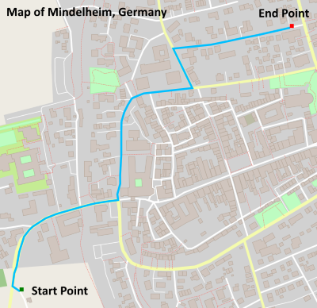

# C++ Route Planning Project 


This project implements a A* route planner running on OpenStreetMap in C++, similar to what is used on professional router planners like Google Maps. 

It can calculate and draw the shortest path from point a to point b. The user enters two coordinates with x and y between 0 and 100, then the map is drawn using the io2d library and the shortest path is rendered in blue:





The distance between the two points is printed out in the console in meters afterwards.


## Compiling and Running

### Compiling
Check out [my detailed setup guide](https://knowledge.udacity.com/questions/42416), which also has a setup for Linux dependencies under the "Test" rubric. 

You need to install io2d and its dependencies first. Under Windows, you can use [vcpkg](https://github.com/microsoft/vcpkg) to do that easily:

```
vcpkg install io2d:x64-windows
```

To compile the project, first, create a `build` directory and change to that directory:

```
mkdir build && cd build
```
From within the `build` directory, then run `cmake` and `make` as follows and change the path to your vcpkg directory:
```
cmake -DCMAKE_TOOLCHAIN_FILE=vcpkg_root/scripts/buildsystems/vcpkg.cmake -DCMAKE_GENERATOR_PLATFORM=x64 ..
make
```
Now the CppND-Route-Planning-Project executable should have been created in the /bin folder.


### Running

The executables will be placed in the `bin` directory. From within `build`, you can run the project as follows:
```
../bin/CppND-Route-Planning-Project -f ../map.osm
```
